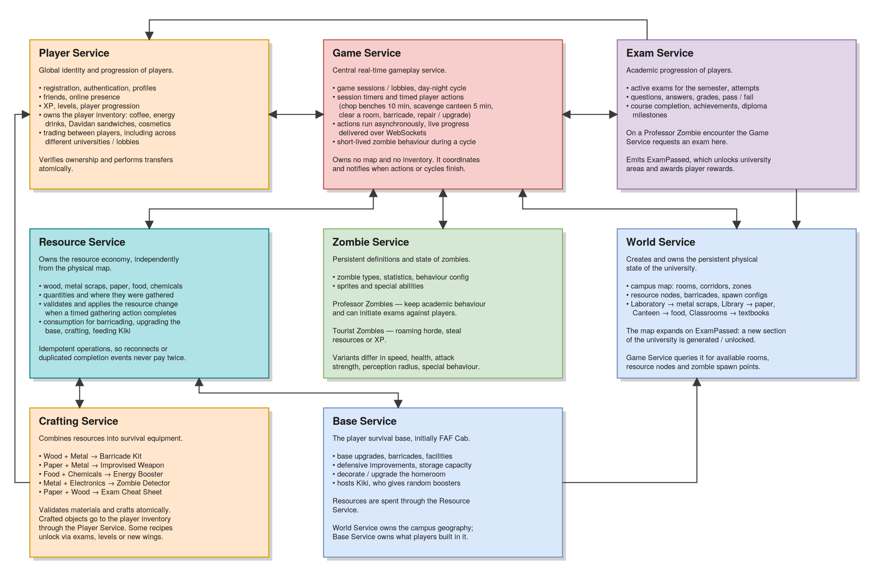

# PAD-team1

# Topic - In Kahoots with the Undead - Communication Contract

This document outlines the communication contracts for the microservices within the **"In Kahoots with the Undead"** platform a zombie-apocalypse survival game set during the FAF university exam season. All services that require user authentication or player-specific information will validate requests using a **JWT (JSON Web Token)** provided in the `Authorization` header.

## Overview

The platform is a distributed set of microservices simulating a persistent, multiplayer survival experience. Players wake up in FAF Cab, scavenge resources, fight zombies, attend PBL presentations, and (hopefully) survive the exam season. Each microservice encapsulates a specific game domain to ensure modularity, independence, and maintainability.

Microservices are implemented using multiple technologies to optimize performance and leverage language-specific strengths:

- **Elixir/Phoenix:** Player Service (Dima), Game Service (Dima), Exam Service (Alexandra), World Service (Alexandra)
- **Ruby/Sinatra** Zombie Service (Ivan), Resource Service (Ivan), Base Service (Sasha), Crafting Service (Sasha)

## Technologies & Communication Patterns

| Owner                    | Services                         | Language & Framework | Database   | Communication Patterns                                                | Motivation & Trade-offs                                                                                                                                                                                                                                                                                                                                                      |
| ------------------------ | -------------------------------- | -------------------- | ---------- | --------------------------------------------------------------------- | ---------------------------------------------------------------------------------------------------------------------------------------------------------------------------------------------------------------------------------------------------------------------------------------------------------------------------------------------------------------------------- |
| Dmitrii Belih            | Player Service, Game Service     | Elixir, Phoenix      | PostgreSQL | REST with JWT auth, WebSockets (Phoenix Channels), async timers, CQRS | Phoenix's secure auth plugs and channels are ideal for player identity and real-time gameplay. Elixir's lightweight processes and OTP supervision handle high-concurrency lobbies, day/night cycles and live action progress over WebSockets.                                                                                                                                |
| Alexandra Mihalevschi    | Exam Service, World Service      | Elixir, Phoenix      | PostgreSQL | REST, Async event-driven updates (PubSub), notifications, CQRS        | Elixir's OTP supervision gives us fault-tolerant exam grading workflows and reliable world-state mutations. Phoenix PubSub makes fanning out `ExamPassed` events to the World Service and achievements effortless.                                                                                                                                                           |
| Ivan Rudenco             | Zombie Service, Resource Service | Ruby, Sinatra        | PostgreSQL | REST, Idempotent operations, Async notification queues, CQRS          | Sinatra on Rack keeps zombie-config endpoints lightweight and read-friendly. `dry-schema` validates inbound payloads at the controller boundary. Idempotent resource operations (gain / consume / transfer) are protected by a unique `event_id` index and executed inside `Sequel.transaction { ... }` blocks against PostgreSQL.                                           |
| Bujor - Cobili Alexandra | Base Service, Crafting Service   | Ruby, Sinatra        | PostgreSQL | REST, Atomic transactions, Async event-driven updates, CQRS           | Sinatra modular apps (`Sinatra::Base` subclasses) keep base upgrades, Kiki rewards and atomic recipe resolution isolated and unit-testable. `Sequel.transaction` makes consume-then-credit flows atomic against PostgreSQL, while `dry-events` (or `wisper`) publishers emit `inventory.changed` events that the Player Service consumes via Sidekiq (or `good_job`) queues. |

## Architectural Diagram



The architectural diagram (provided separately by the team) illustrates how the eight microservices interact through the API Gateway and Service Registry. The Game Service sits at the center of the live game loop, while Player, Resource, Exam, World, Zombie, Base and Crafting Services each own a distinct domain. Inter-service communication is a mix of synchronous REST, asynchronous events and WebSocket fan-out.

## в†’

***

## Authentication

All endpoints marked with **Headers: `Authorization: Bearer <jwt>`** require a valid JWT issued by the **Player Service**. The token contains:

- `sub` the player UUID
- `roles` e.g. `["player"]`, `["player", "moderator"]`

Cross-service calls (e.g. Game Service в†’ Resource Service) use a dedicated **service-to-service JWT** signed with a shared internal secret.

---

## 1. Player Service

Handles the **global identity and progression** of players: registration, authentication, profiles, friends, online presence, XP, levels and progression. Also owns each player's **persistent inventory** of consumables, cosmetics and other player-owned objects.

### Responsibilities

- Register and authenticate players.
- Issue JWTs upon successful login.
- Manage profiles, XP, levels and progression.
- Manage friends, friend requests and online presence.
- Own the persistent player inventory (consumables, cosmetics, equipment).

### Endpoints

#### Register a Player

`POST /api/players/register`
Description: Creates a new player account.
Payload:

```json
{
  "username": "undead_survivor",
  "email": "player@faf.university",
  "password": "<hashed_password>"
}
```

Success Response (201 Created):

```json
{
  "player_id": "player-uuid-123",
  "username": "undead_survivor",
  "level": 1,
  "xp": 0
}
```

#### Login

`POST /api/players/login`
Description: Authenticates a player and returns a JWT.
Payload:

```json
{
  "email": "player@faf.university",
  "password": "<plain_password>"
}
```

Success Response (200 OK):

```json
{
  "jwt": "<jwt_token>",
  "player_id": "player-uuid-123",
  "roles": ["player"]
}
```

#### Get Player Profile

`GET /api/players/{player_id}`
Description: Retrieves public profile information for a player.
Headers: `Authorization: Bearer <jwt>`
Success Response (200 OK):

```json
{
  "player_id": "player-uuid-123",
  "username": "undead_survivor",
  "level": 7,
  "xp": 1340,
  "university": "FAF",
  "title": "Survivor of the Pumpkin"
}
```

#### Update Player Profile

`PATCH /api/players/{player_id}`
Description: Updates the player's public profile.
Headers: `Authorization: Bearer <jwt>`
Payload:

```json
{
  "title": "Pumpkin Slayer",
  "avatar": "axe_wielding"
}
```

#### Delete Player Profile

`DELETE /api/players/{player_id}`
Description: Deletes the account. Inventory and active trades are released first.

Success Response (204 No Content)

#### Level XP

`GET /api/players/{player_id}/xp`
Description: Reads the progression counters.
Payload: —

Success Response (200 OK):

```json
{
  "player_id": "player-uuid-123",
  "xp": 3420,
  "level": 7,
  "xp_to_next_level": 580
}
```

#### Update XP

`PATCH /api/players/{player_id}/xp`
Description: Adds or removes XP. Called by Game Service (kills, finished actions), Exam Service (passed exams) and Tourist Zombies (stealing XP). Idempotent through `operation_id`.
Payload:

```json
{
  "operation_id": "xp-op-uuid-555",
  "delta": 250,
  "reason": "EXAM_PASSED",
  "source_service": "exam-service"
}
```

Success Response (200 OK):

```json
{
  "player_id": "player-uuid-123",
  "xp": 3670,
  "level": 8,
  "leveled_up": true
}
```

#### Get Player Inventory

`GET /api/players/{player_id}/inventory`
Description: Returns the player's full inventory.
Headers: `Authorization: Bearer <jwt>`
Success Response (200 OK):

```json
[
  { "item_id": "coffee-01", "name": "Coffee", "count": 3 },
  { "item_id": "energy-01", "name": "Energy Drink", "count": 1 },
  { "item_id": "sandwich-01", "name": "Davidan Sandwich", "count": 2 },
  { "item_id": "axe-01", "name": "Improvised Axe", "count": 1 }
]
```

#### Add Item to Inventory **[internal]**

`POST /api/players/{player_id}/inventory`
Description: Puts an item in the inventory. Called by Crafting Service (crafted object), World Service (Kiki reward) and Game Service (loot). Idempotent through `operation_id`.
Payload:

```json
{
  "operation_id": "grant-uuid-901",
  "code": "ZOMBIE_DETECTOR",
  "type": "equipment",
  "quantity": 1,
  "source": "crafting-service"
}
```

Success Response (201 Created):

```json
{
  "item_id": "item-uuid-12",
  "code": "ZOMBIE_DETECTOR",
  "quantity": 1
}
```

#### Update / Consume Item

`PATCH /api/players/{player_id}/inventory/{item_id}`
Description: Changes the quantity of an item. Consuming a Coffee is `delta: -1`; the record stays at quantity 0 instead of being deleted (CRU only).
Payload:

```json
{
  "operation_id": "consume-uuid-33",
  "delta": -1,
  "reason": "CONSUMED"
}
```

Success Response (200 OK):

```json
{
  "item_id": "item-uuid-1",
  "code": "COFFEE",
  "quantity": 2
}
```

### Add Friend

`POST /api/players/{player_id}/friends`
Description: Sends a friend request.
Payload:

```json
{
  "target_player_id": "player-uuid-456"
}
```

Success Response (201 Created):

```json
{
  "friendship_id": "friend-uuid-10",
  "target_player_id": "player-uuid-456",
  "status": "PENDING"
}
```

#### Get Friends List

`GET /api/players/{player_id}/friends`
Headers: `Authorization: Bearer <jwt>`
Success Response (200 OK):

```json
[{ "player_id": "player-uuid-456", "username": "kiki", "status": "online" }]
```

#### Remove Friend

`DELETE /api/players/{player_id}/friends/{friendship_id}`
Description: Removes the friendship or cancels the request.
Payload: —

Success Response (204 No Content)

#### Create a Trade

`POST /api/trades`
Description: Opens a trade offer towards another player. Works across lobbies/universities. Ownership of every offered item is verified here and the items are locked until the trade resolves.
Payload:

```json
{
  "from_player_id": "player-uuid-123",
  "to_player_id": "player-uuid-456",
  "offered_items": [{ "item_id": "item-uuid-9", "quantity": 1 }],
  "requested_items": [{ "code": "ENERGY_DRINK", "quantity": 2 }]
}
```

Success Response (201 Created):

```json
{
  "trade_id": "trade-uuid-77",
  "status": "PENDING",
  "expires_at": "2026-09-10T14:15:00Z"
}
```

Errors: `403 ITEM_NOT_OWNED`, `409 ITEM_ALREADY_LOCKED`

#### Accept a Trade

`POST /api/trades/{trade_id}/accept`
Description: Executes the transfer atomically — both sides move or neither does. On failure everything is rolled back and the items unlocked.
Payload:

```json
{
  "player_id": "player-uuid-456"
}
```

Success Response (200 OK):

```json
{
  "trade_id": "trade-uuid-77",
  "status": "COMPLETED",
  "completed_at": "2026-09-10T14:06:40Z"
}
```

Errors: `409 TRADE_EXPIRED`, `409 REQUESTED_ITEMS_MISSING`

#### Reject / Cancel a Trade

`POST /api/trades/{trade_id}/reject`
Description: Cancels the offer and unlocks the items. Callable by either side.
Payload: —

Success Response (200 OK):

```json
{
  "trade_id": "trade-uuid-77",
  "status": "REJECTED"
}
```

#### List Trades

`GET /api/trades?player_id={player_id}&status=PENDING`
Description: Returns the trades a player is involved in.
Payload: —

Success Response (200 OK):

```json
{
  "trades": [
    {
      "trade_id": "trade-uuid-77",
      "from_player_id": "player-uuid-123",
      "to_player_id": "player-uuid-456",
      "status": "PENDING"
    }
  ]
}
```

---

## 2. Game Service

The **central real-time gameplay service**. Owns game sessions/lobbies, the day/night cycle, session timers and timed player actions. Also coordinates player trading, zombie behavior and short-lived game events. **Does not permanently own the university map or player inventory.**

### Responsibilities

- Create, join and leave game lobbies.
- Run the day/night cycle and tick timers.
- Start asynchronous actions (chop benches, scavenge canteen, clear room, barricade, repair/upgrade base).
- Push live progress over WebSockets.
- Coordinate trading between players (possibly across universities).
- Verify ownership and perform atomic inventory transfers.
- Manage short-lived zombie behavior during a cycle.
- Notify players and services when actions, attacks or cycles finish.

### REST Endpoints

#### Create a Lobby

`POST /api/game/lobbies`
Headers: `Authorization: Bearer <jwt>`
Payload:

```json
{
  "host_id": "player-uuid-123",
  "university": "FAF",
  "max_players": 8,
  "name": "Cab Survivors"
}
```

Success Response (201 Created):

```json
{
  "lobby_id": "lobby-uuid-789",
  "host_id": "player-uuid-123",
  "university": "FAF",
  "day_cycle": 1,
  "phase": "day",
  "players": ["player-uuid-123"]
}
```

#### Join a Lobby

`POST /api/game/lobbies/{lobby_id}/join`
Headers: `Authorization: Bearer <jwt>`
Payload:

```json
{ "player_id": "player-uuid-456" }
```

#### Leave a Lobby

`POST /api/game/lobbies/{lobby_id}/leave`
Headers: `Authorization: Bearer <jwt>`
Payload:

```json
{ "player_id": "player-uuid-456" }
```

#### Start a Session

`POST /api/lobbies/{lobby_id}/start`
Description: Host starts the game. Game Service pulls the map from World Service and the zombie configurations from Zombie Service, then begins the first day.
Payload:

```json
{
  "cycle_duration_seconds": 300,
  "semester_length_cycles": 14
}
```

Success Response (201 Created):

```json
{
  "session_id": "session-uuid-900",
  "lobby_id": "lobby-uuid-77",
  "cycle": "DAY",
  "cycle_number": 1,
  "map_id": "map-uuid-5",
  "started_at": "2026-09-10T14:00:00Z"
}
```

Errors: `403 NOT_LOBBY_HOST`, `409 NOT_ENOUGH_PLAYERS`

#### Get Session State

`GET /api/sessions/{session_id}`
Description: Snapshot of the running game — used on reconnect before the WebSocket takes over.
Payload: —

Success Response (200 OK):

```json
{
  "session_id": "session-uuid-900",
  "status": "RUNNING",
  "cycle": "NIGHT",
  "cycle_number": 4,
  "cycle_ends_at": "2026-09-10T14:25:00Z",
  "alive_zombies": 12,
  "players": [
    {
      "player_id": "player-uuid-123",
      "health": 80,
      "current_room_id": "room-uuid-3"
    }
  ]
}
```

#### End a Session

`POST /api/sessions/{session_id}/end`
Description: Ends the semester. Final XP is pushed to Player Service, results to Exam Service.
Payload: —

Success Response (200 OK):

```json
{
  "session_id": "session-uuid-900",
  "status": "FINISHED",
  "survivors": ["player-uuid-123"],
  "cycles_survived": 14
}
```

#### Start a Timed Action

`POST /api/game/lobbies/{lobby_id}/actions`
Description: Starts an async action like "chop bench for 10 minutes". Returns immediately; progress is pushed over WebSockets.
Headers: `Authorization: Bearer <jwt>`
Payload:

```json
{
  "player_id": "player-uuid-123",
  "action_type": "chop_bench",
  "target": "bench-room-A1",
  "duration_seconds": 600
}
```

Success Response (202 Accepted):

```json
{
  "action_id": "action-uuid-001",
  "status": "in_progress",
  "started_at": "2026-09-05T10:00:00Z",
  "completes_at": "2026-09-05T10:10:00Z"
}
```

Error Response (409 Conflict):

```json
{ "error": "Player already has an active action." }
```

#### Get Action Status

`GET /api/sessions/{session_id}/actions/{action_id}`
Description: Polling fallback for when the WebSocket dropped. On completion the reward comes from Resource Service, this service only reports it.
Payload: —

Success Response (200 OK):

#### Cancel an Action

`DELETE /api/game/actions/{action_id}`
Headers: `Authorization: Bearer <jwt>`

#### Zombie Action **[internal]**

`POST /api/sessions/{session_id}/zombie-actions`
Description: An action issued by a zombie instance instead of a player, as part of the behavior Game Service drives during the current cycle. A `PROFESSOR` zombie triggers an exam request towards Exam Service; a `TOURIST` zombie steals resources or XP. Same async contract as player actions — `202` plus a WebSocket event — different actor. The `zombie_id` is only valid within the cycle that spawned it.
Payload:

```json
{
  "zombie_id": "zombie-uuid-31",
  "zombie_type": "PROFESSOR",
  "action": "ADMINISTER_EXAM",
  "target_player_id": "player-uuid-123",
  "room_id": "room-uuid-3"
}
```

Success Response (202 Accepted):

```json
{
  "action_id": "zaction-uuid-77",
  "status": "IN_PROGRESS",
  "exam_id": "exam-uuid-14",
  "deadline_seconds": 120
}
```

Tourist variant:

```json
{
  "zombie_id": "zombie-uuid-52",
  "zombie_type": "TOURIST",
  "action": "STEAL",
  "target_player_id": "player-uuid-123",
  "steal_target": "XP"
}
```

```json
{
  "action_id": "zaction-uuid-78",
  "status": "COMPLETED",
  "stolen": { "type": "XP", "amount": 40 }
}
```

#### Advance Day/Night Cycle

`POST /api/game/lobbies/{lobby_id}/cycle`
Headers: `Authorization: Bearer <service_jwt>`

### WebSocket Connection

`wss://api.undead/ws/game/lobbies/{lobby_id}?token=<JWT>`

#### Client Server Events

```json
{ "type": "join_lobby",  "lobby_id": "lobby-uuid-789" }
{ "type": "leave_lobby", "lobby_id": "lobby-uuid-789" }
{ "type": "action_progress_request", "action_id": "action-uuid-001" }
```

#### Server Client Events

```json
{ "type": "action_started",   "action_id": "...", "player_id": "...", "duration_seconds": 600 }
{ "type": "action_progress",  "action_id": "...", "elapsed_seconds": 120, "percent": 20 }
{ "type": "action_completed", "action_id": "...", "reward": [{ "item_id": "wood-01", "count": 4 }] }
{ "type": "zombie_attack",    "zombie_id": "...", "target_player_id": "...", "damage": 15 }
{ "type": "trade_offer",      "trade_id": "...", "from_player_id": "...", "offer": [...] }
{ "type": "cycle_changed",    "phase": "night", "day": 2 }
{ "type": "encounter_started","encounter_id": "...", "zombie_type": "professor_zombie" }
```

---

## 3. Zombie Service

Manages **zombie type definitions, behaviour configurations and per-instance state** within a game session (lobby). The service owns zombie instances, their current state/stats and their inventories, so that when a zombie steals resources from the world or from players those items are held by the zombie instance until it is killed. On death, the zombie's full inventory is transferred atomically to the player who killed it.

### Responsibilities

- Maintain a registry of zombie types with full CRUD: create, read, update and delete their stats, loot and behaviour configurations.
- CRUD zombie instances within a session: spawn, list, get, update and despawn.
- Track each zombie instance's current state (status, room, active behaviours).
- Track each zombie instance's stats (type, health, damage, ...).
- Own each zombie instance's inventory of stolen resources (read/update).
- Transfer a zombie's full inventory to the killing player on death.
- Provide zombie type data to Game Service for encounter resolution.

### Endpoints

#### Zombie Type CRUD

##### Create a Zombie Type

`POST /api/zombies/types`
Description: Creates a new zombie type definition with its stats and behaviour configuration. Used at season bootstrap and by moderators to add new enemy types.
Headers: `Authorization: Bearer <service_jwt>`
Payload:

```json
{
  "type_id": "tourist_zombie",
  "name": "Tourist Zombie",
  "health": 80,
  "damage": 12,
  "speed": 1.5,
  "loot_table_id": "loot-tourist-01",
  "behaviours": [
    { "trigger": "player_nearby", "action": "chase", "range_tiles": 5 }
  ]
}
```

Success Response (201 Created):

```json
{
  "type_id": "tourist_zombie",
  "name": "Tourist Zombie",
  "health": 80,
  "damage": 12,
  "speed": 1.5,
  "loot_table_id": "loot-tourist-01",
  "behaviours": [
    { "trigger": "player_nearby", "action": "chase", "range_tiles": 5 }
  ]
}
```

##### List Zombie Types

`GET /api/zombies/types`
Description: Returns all configured zombie types with their stats and behaviours.
Headers: `Authorization: Bearer <service_jwt>`
Success Response (200 OK):

```json
[
  {
    "type_id": "professor_zombie",
    "name": "Professor Zombie",
    "health": 100,
    "damage": 15,
    "speed": 1.2,
    "loot_table_id": "loot-professor-01"
  },
  {
    "type_id": "fast_zombie",
    "name": "Caffeinated Sprinter",
    "health": 60,
    "damage": 10,
    "speed": 3.0,
    "loot_table_id": "loot-sprinter-01"
  }
]
```

##### Get Zombie Type Details

`GET /api/zombies/types/{type_id}`
Description: Returns full details for a single zombie type, including its behaviour rules.
Headers: `Authorization: Bearer <service_jwt>`
Success Response (200 OK):

```json
{
  "type_id": "professor_zombie",
  "name": "Professor Zombie",
  "health": 100,
  "damage": 15,
  "speed": 1.2,
  "loot_table_id": "loot-professor-01",
  "behaviours": [
    { "trigger": "player_nearby", "action": "chase", "range_tiles": 5 },
    { "trigger": "player_in_room", "action": "steal", "max_items": 2 },
    { "trigger": "day_phase", "action": "hide", "location": "exam_hall" }
  ]
}
```

Error Response (404 Not Found):

```json
{ "error": "Zombie type not found." }
```

##### Update a Zombie Type

`PATCH /api/zombies/types/{type_id}`
Description: Edits a zombie type's stats or behaviour rules without recreating it, so existing instances keep referencing a valid `type_id`.
Headers: `Authorization: Bearer <service_jwt>`
Payload:

```json
{
  "health": 95,
  "speed": 1.4,
  "behaviours": [
    { "trigger": "player_nearby", "action": "chase", "range_tiles": 6 }
  ]
}
```

Success Response (200 OK):

```json
{
  "type_id": "professor_zombie",
  "name": "Professor Zombie",
  "health": 95,
  "damage": 15,
  "speed": 1.4,
  "loot_table_id": "loot-professor-01",
  "behaviours": [
    { "trigger": "player_nearby", "action": "chase", "range_tiles": 6 },
    { "trigger": "player_in_room", "action": "steal", "max_items": 2 },
    { "trigger": "day_phase", "action": "hide", "location": "exam_hall" }
  ]
}
```

##### Delete a Zombie Type

`DELETE /api/zombies/types/{type_id}`
Description: Removes a zombie type from the registry. Refused while active instances still reference it.
Headers: `Authorization: Bearer <service_jwt>`
Success Response (200 OK):

```json
{ "type_id": "tourist_zombie", "deleted": true }
```

Error Response (409 Conflict):

```json
{ "error": "Cannot delete a zombie type that still has active instances." }
```

#### Zombie Instance CRUD (in a Session)

##### List Zombie Instances in a Session

`GET /api/zombies/lobbies/{lobby_id}/instances`
Description: Returns all active zombie instances in a session (lobby), including their current state, stats and inventories.
Headers: `Authorization: Bearer <service_jwt>`
Success Response (200 OK):

```json
[
  {
    "zombie_id": "zombie-uuid-001",
    "type_id": "professor_zombie",
    "lobby_id": "lobby-uuid-789",
    "health": 100,
    "room_id": "exam-hall-3",
    "state": { "status": "idle", "phase": "day" },
    "inventory": [
      { "item_id": "coffee-01", "count": 1 },
      { "item_id": "metal-01", "count": 3 }
    ]
  }
]
```

##### Spawn a Zombie Instance (Create)

`POST /api/zombies/lobbies/{lobby_id}/instances`
Description: Spawns a new zombie instance in a session. Called by Game Service at cycle transitions or encounter triggers.
Headers: `Authorization: Bearer <service_jwt>`
Payload:

```json
{
  "type_id": "professor_zombie",
  "room_id": "exam-hall-3"
}
```

Success Response (201 Created):

```json
{
  "zombie_id": "zombie-uuid-002",
  "type_id": "professor_zombie",
  "lobby_id": "lobby-uuid-789",
  "health": 100,
  "room_id": "exam-hall-3",
  "state": { "status": "idle", "phase": "day" },
  "inventory": []
}
```

##### Get a Zombie Instance (Read)

`GET /api/zombies/lobbies/{lobby_id}/instances/{zombie_id}`
Description: Returns a single zombie instance's full record — state, stats and inventory.
Headers: `Authorization: Bearer <service_jwt>`
Success Response (200 OK):

```json
{
  "zombie_id": "zombie-uuid-001",
  "type_id": "professor_zombie",
  "lobby_id": "lobby-uuid-789",
  "health": 60,
  "room_id": "canteen",
  "state": { "status": "stealing", "target_player_id": "player-uuid-123", "phase": "day" },
  "inventory": [
    { "item_id": "coffee-01", "count": 1 },
    { "item_id": "metal-01", "count": 3 }
  ]
}
```

Error Response (404 Not Found):

```json
{ "error": "Zombie instance not found." }
```

##### Update a Zombie Instance (Update)

`PATCH /api/zombies/lobbies/{lobby_id}/instances/{zombie_id}`
Description: Updates structural instance fields such as the room the zombie currently occupies. For state, stats or inventory changes, use the dedicated `/state`, `/stats` and `/inventory` endpoints below.
Headers: `Authorization: Bearer <service_jwt>`
Payload:

```json
{ "room_id": "library-2" }
```

Success Response (200 OK):

```json
{
  "zombie_id": "zombie-uuid-001",
  "type_id": "professor_zombie",
  "lobby_id": "lobby-uuid-789",
  "health": 60,
  "room_id": "library-2",
  "state": { "status": "stealing", "target_player_id": "player-uuid-123", "phase": "day" },
  "inventory": [
    { "item_id": "coffee-01", "count": 1 },
    { "item_id": "metal-01", "count": 3 }
  ]
}
```

##### Despawn a Zombie Instance (Delete)

`DELETE /api/zombies/lobbies/{lobby_id}/instances/{zombie_id}`
Description: Removes a zombie instance from the session without transferring its loot (event despawn, server cleanup, zombie fled). To hand the inventory to a killing player, use the "Zombie Killed" flow below instead.
Headers: `Authorization: Bearer <service_jwt>`
Success Response (200 OK):

```json
{ "zombie_id": "zombie-uuid-001", "lobby_id": "lobby-uuid-789", "despawned": true }
```

Error Response (409 Conflict):

```json
{ "error": "Zombie instance not found or already despawned." }
```

#### Zombie State (Read / Update)

##### Get Zombie State

`GET /api/zombies/instances/{zombie_id}/state`
Description: Returns the zombie's current behavioural state.
Headers: `Authorization: Bearer <service_jwt>`
Success Response (200 OK):

```json
{
  "zombie_id": "zombie-uuid-001",
  "status": "chasing",
  "room_id": "exam-hall-3",
  "target_player_id": "player-uuid-123",
  "active_behaviours": [
    { "trigger": "player_nearby", "action": "chase", "range_tiles": 5 }
  ],
  "phase": "day"
}
```

##### Update Zombie State

`PATCH /api/zombies/instances/{zombie_id}/state`
Description: Updates the zombie's behavioural state (idle → chasing → stealing → hiding/dead). Called by Game Service during encounters and by the zombie tick loop.
Headers: `Authorization: Bearer <service_jwt>`
Payload:

```json
{
  "status": "stealing",
  "room_id": "canteen",
  "target_player_id": "player-uuid-456"
}
```

Success Response (200 OK):

```json
{
  "zombie_id": "zombie-uuid-001",
  "status": "stealing",
  "room_id": "canteen",
  "target_player_id": "player-uuid-456",
  "active_behaviours": [
    { "trigger": "player_in_room", "action": "steal", "max_items": 2 }
  ],
  "phase": "day"
}
```

#### Zombie Stats (Read / Update)

##### Get Zombie Stats

`GET /api/zombies/instances/{zombie_id}/stats`
Description: Returns the zombie's combat-relevant stats (type, health, damage, ...).
Headers: `Authorization: Bearer <service_jwt>`
Success Response (200 OK):

```json
{
  "zombie_id": "zombie-uuid-001",
  "type_id": "professor_zombie",
  "health": 60,
  "max_health": 100,
  "damage": 15,
  "speed": 1.2
}
```

##### Update Zombie Stats

`PATCH /api/zombies/instances/{zombie_id}/stats`
Description: Updates the zombie's current stats (e.g. damage taken during a fight). Idempotent under a per-event `event_id` where needed.
Headers: `Authorization: Bearer <service_jwt>`
Payload:

```json
{ "health": 40 }
```

Success Response (200 OK):

```json
{
  "zombie_id": "zombie-uuid-001",
  "type_id": "professor_zombie",
  "health": 40,
  "max_health": 100,
  "damage": 15,
  "speed": 1.2
}
```

#### Zombie Inventory (Read / Update)

##### Get Zombie Inventory

`GET /api/zombies/instances/{zombie_id}/inventory`
Description: Returns the zombie's full inventory of stolen resources. Called by Game Service when a zombie is killed to know what to transfer.
Headers: `Authorization: Bearer <service_jwt>`
Success Response (200 OK):

```json
[
  { "item_id": "coffee-01", "count": 1 },
  { "item_id": "metal-01", "count": 6 },
  { "item_id": "wood-01", "count": 2 }
]
```

##### Update Zombie Inventory

`PATCH /api/zombies/instances/{zombie_id}/inventory`
Description: Adds or removes stolen items from the zombie's inventory. Idempotent via `event_id`.
Headers: `Authorization: Bearer <service_jwt>`
Payload:

```json
{
  "operation": "add",
  "items": [
    { "item_id": "sandwich-01", "count": 1 }
  ],
  "event_id": "evt-uuid-steal-002"
}
```

Success Response (200 OK):

```json
[
  { "item_id": "coffee-01", "count": 1 },
  { "item_id": "metal-01", "count": 6 },
  { "item_id": "wood-01", "count": 2 },
  { "item_id": "sandwich-01", "count": 1 }
]
```

Error Response (409 Conflict):

```json
{ "error": "Insufficient items to remove from zombie inventory." }
```

#### Zombie Event Flows

The following endpoints reuse the primitives above for in-game event flows.

##### Zombie Steals from World

`POST /api/zombies/instances/{zombie_id}/steal-world`
Description: Records resources stolen by a zombie from a world tile. Convenience wrapper over "Update Zombie Inventory" (`operation: add`); also reserves the grabbed amount on the Resource Service map. Called by World Service when a zombie occupies a resource node. Idempotent via `event_id`.
Headers: `Authorization: Bearer <service_jwt>`
Payload:

```json
{
  "event_id": "evt-uuid-steal-001",
  "room_id": "lab-204",
  "items": [
    { "item_id": "metal-01", "count": 3 },
    { "item_id": "wood-01", "count": 2 }
  ]
}
```

Success Response (200 OK):

```json
{
  "zombie_id": "zombie-uuid-001",
  "inventory": [
    { "item_id": "coffee-01", "count": 1 },
    { "item_id": "metal-01", "count": 6 },
    { "item_id": "wood-01", "count": 2 }
  ]
}
```

##### Zombie Steals from Player

`POST /api/zombies/instances/{zombie_id}/steal-player`
Description: Records resources stolen by a zombie from a player's inventory. Convenience wrapper over "Update Zombie Inventory"; also deducts the items from the Player Service inventory. Called by Game Service during encounter resolution. Idempotent via `event_id`.
Headers: `Authorization: Bearer <service_jwt>`
Payload:

```json
{
  "event_id": "evt-uuid-steal-002",
  "player_id": "player-uuid-123",
  "items": [{ "item_id": "sandwich-01", "count": 1 }]
}
```

Success Response (200 OK):

```json
{
  "zombie_id": "zombie-uuid-001",
  "inventory": [
    { "item_id": "coffee-01", "count": 1 },
    { "item_id": "metal-01", "count": 6 },
    { "item_id": "wood-01", "count": 2 },
    { "item_id": "sandwich-01", "count": 1 }
  ]
}
```

##### Zombie Killed

`POST /api/zombies/instances/{zombie_id}/killed`
Description: Transfers the zombie's full inventory to the player who killed it, clears its state/stats and despawns it. Internally: reads the inventory, credits the killer via Player Service, then removes the instance. Idempotent via `event_id`.
Headers: `Authorization: Bearer <service_jwt>`
Payload:

```json
{
  "event_id": "evt-uuid-kill-001",
  "killer_player_id": "player-uuid-123",
  "lobby_id": "lobby-uuid-789"
}
```

Success Response (200 OK):

```json
{
  "zombie_id": "zombie-uuid-001",
  "type_id": "professor_zombie",
  "transferred_items": [
    { "item_id": "coffee-01", "count": 1 },
    { "item_id": "metal-01", "count": 6 },
    { "item_id": "wood-01", "count": 2 },
    { "item_id": "sandwich-01", "count": 1 }
  ],
  "despawned": true
}
```

Error Response (409 Conflict):

```json
{ "error": "Zombie instance not found or already despawned." }
```

---

## 4. Resource Service

Acts as the **single source of truth for resource quantities in a game session**: how much of every resource exists on the map (resource points), how much of every resource is held by any individual entity (player, zombie, base, crafting job) and an immutable audit trail of every movement as a transaction. Game Service, World Service, Base Service and Crafting Service all request resources through this service. All mutating operations are idempotent via `event_id` — resources are never duplicated and never silently disappear.

### Responsibilities

- CRUD resource points on the map (location + resource type + current amount / capacity).
- Serve the current amount of any resource on the map and update it (restock / deplete / set).
- Track and update the resource count held by any individual entity.
- Execute gathering actions: atomically deduct from a map location and credit the gathering entity, returning the appropriate amount actually gathered.
- Record every gather / transfer / allocation as a transaction and expose its details for verification.

### Endpoints

#### Resource Point CRUD

##### List Resource Points on the Map

`GET /api/resources/points`
Description: Returns all resource points on the map, optionally filtered by `room_id` or `resource`.
Headers: `Authorization: Bearer <service_jwt>`
Query Parameters: `room_id` (optional), `resource` (optional)
Success Response (200 OK):

```json
[
  {
    "point_id": "point-uuid-001",
    "room_id": "lab-204",
    "resource": "metal-01",
    "amount": 12,
    "max_amount": 30
  },
  {
    "point_id": "point-uuid-002",
    "room_id": "canteen",
    "resource": "food-01",
    "amount": 30,
    "max_amount": 50
  }
]
```

##### Create a Resource Point

`POST /api/resources/points`
Description: Creates a new resource point on the map. Called by World Service when a room / resource node is unlocked, or by moderators pre-seeding a season.
Headers: `Authorization: Bearer <service_jwt>`
Payload:

```json
{
  "room_id": "lab-204",
  "resource": "metal-01",
  "amount": 15,
  "max_amount": 40
}
```

Success Response (201 Created):

```json
{
  "point_id": "point-uuid-003",
  "room_id": "lab-204",
  "resource": "metal-01",
  "amount": 15,
  "max_amount": 40
}
```

##### Get a Resource Point

`GET /api/resources/points/{point_id}`
Description: Returns full details for a single resource point.
Headers: `Authorization: Bearer <service_jwt>`
Success Response (200 OK):

```json
{
  "point_id": "point-uuid-001",
  "room_id": "lab-204",
  "resource": "metal-01",
  "amount": 9,
  "max_amount": 30
}
```

Error Response (404 Not Found):

```json
{ "error": "Resource point not found." }
```

##### Update a Resource Point

`PATCH /api/resources/points/{point_id}`
Description: Edits a resource point's type or capacity. Use "Update Resource Amount on the Map" below for routine restock / consume deltas.
Headers: `Authorization: Bearer <service_jwt>`
Payload:

```json
{ "resource": "scrap-01", "max_amount": 60 }
```

Success Response (200 OK):

```json
{
  "point_id": "point-uuid-001",
  "room_id": "lab-204",
  "resource": "scrap-01",
  "amount": 9,
  "max_amount": 60
}
```

##### Delete a Resource Point

`DELETE /api/resources/points/{point_id}`
Description: Removes a resource point from the map (e.g. a room converted to another type). Refused while a gather transaction is in flight.
Headers: `Authorization: Bearer <service_jwt>`
Success Response (200 OK):

```json
{ "point_id": "point-uuid-001", "deleted": true }
```

#### Resource Amount on the Map (Read / Update)

##### Get Resource Amount on the Map

`GET /api/resources/map`
Description: Returns the amount of any resource on the map. Filter by `room_id`, `resource`, or both; with no filters it returns the full map's amounts.
Headers: `Authorization: Bearer <service_jwt>`
Query Parameters: `room_id` (optional), `resource` (optional)
Success Response (200 OK):

```json
[
  { "room_id": "lab-204", "resource": "metal-01", "amount": 9 },
  { "room_id": "lab-204", "resource": "wood-01", "amount": 6 },
  { "room_id": "canteen", "resource": "food-01", "amount": 22 }
]
```

Error Response (404 Not Found):

```json
{ "error": "No such resource." }
```

##### Update Resource Amount on the Map

`PATCH /api/resources/map`
Description: Adjusts the amount of a resource at a map location: `set` (restock to a value), `add` or `remove` (delta). Idempotent via `event_id`.
Headers: `Authorization: Bearer <service_jwt>`
Payload:

```json
{
  "event_id": "evt-uuid-restock-001",
  "room_id": "lab-204",
  "resource": "metal-01",
  "operation": "set",
  "amount": 20
}
```

Success Response (200 OK):

```json
{ "room_id": "lab-204", "resource": "metal-01", "amount": 20 }
```

Error Response (409 Conflict):

```json
{ "error": "Insufficient amount of metal-01 in lab-204." }
```

#### Entity Resource Count (Read / Update)

Every individual resource holder — a player, a zombie, the base or a crafting job — is addressed as an entity.

##### Get Entity Resource Count

`GET /api/resources/entities/{entity_type}/{entity_id}`
Description: Returns the current resource counts of a single entity. `entity_type` ∈ `player` | `zombie` | `base` | `crafting_job`.
Headers: `Authorization: Bearer <service_jwt>`
Success Response (200 OK):

```json
[
  { "item_id": "metal-01", "count": 3 },
  { "item_id": "wood-01", "count": 2 }
]
```

Error Response (404 Not Found):

```json
{ "error": "Entity not found." }
```

##### Update Entity Resource Count

`PATCH /api/resources/entities/{entity_type}/{entity_id}`
Description: Updates the resource counts of a single entity (`add`, `remove` or `set`). Idempotent via `event_id`; the entity stock and the transaction audit record update atomically inside `Sequel.transaction { ... }`.
Headers: `Authorization: Bearer <service_jwt>`
Payload:

```json
{
  "event_id": "evt-uuid-credit-001",
  "operation": "add",
  "items": [
    { "item_id": "metal-01", "count": 3 }
  ]
}
```

Success Response (200 OK):

```json
[
  { "item_id": "metal-01", "count": 6 },
  { "item_id": "wood-01", "count": 2 }
]
```

Error Response (409 Conflict):

```json
{ "error": "Insufficient stock for item metal-01." }
```

#### Gather

##### Initiate a Gathering Action

`POST /api/resources/gather`
Description: When a gathering action is initiated, the service validates the resource point, deducts the gathered amount from the map and credits the gathering entity atomically. Returns the **appropriate amount actually gathered** — clamped to the amount available at the point and the entity's capacity. Idempotent via `event_id`: repeat calls with the same `event_id` return the original result without re-crediting.
Headers: `Authorization: Bearer <service_jwt>`
Payload:

```json
{
  "event_id": "evt-uuid-gather-001",
  "point_id": "point-uuid-001",
  "resource": "metal-01",
  "entity_type": "player",
  "entity_id": "player-uuid-123",
  "requested_amount": 10
}
```

Success Response (200 OK):

```json
{
  "gather_id": "gather-uuid-001",
  "event_id": "evt-uuid-gather-001",
  "point_id": "point-uuid-001",
  "resource": "metal-01",
  "amount_gathered": 9,
  "requested_amount": 10,
  "remaining_at_point": 0,
  "credited_to": { "entity_type": "player", "entity_id": "player-uuid-123" },
  "status": "completed"
}
```

Error Response (404 Not Found):

```json
{ "error": "Resource point not found or exhausted." }
```

#### Transactions

##### Get Transaction Details

`GET /api/resources/transactions/{transaction_id}`
Description: Returns the details of a prior gather / transfer / allocation so callers can confirm a movement completed successfully before trusting the result (transfer verification).
Headers: `Authorization: Bearer <service_jwt>`
Success Response (200 OK):

```json
{
  "transaction_id": "transaction-uuid-001",
  "event_id": "evt-uuid-gather-001",
  "type": "gather",
  "source": { "type": "point", "point_id": "point-uuid-001", "room_id": "lab-204" },
  "target": { "entity_type": "player", "entity_id": "player-uuid-123" },
  "items_transferred": [
    { "item_id": "metal-01", "count": 9 }
  ],
  "status": "completed",
  "created_at": "2026-09-05T10:05:00Z"
}
```

Error Response (404 Not Found):

```json
{ "error": "Transaction not found." }
```

---

## 5. Exam Service

Responsible for the **actual academic progression of players**: the exam catalog, the courses
that group exams together, the static question bank, live exam attempts and each player's
academic record (grades, achievements, diploma milestones).

When a player encounters a Professor Zombie, the Game Service opens an exam attempt against
this service. Questions are authored statically through the catalog endpoints below — no
dynamic generation. Passing specific exams can trigger events such as unlocking new university
areas or awarding player rewards; completing all Math exams, for example, could unlock a
"Survived the Pumpkin" achievement and notify the World Service to unlock a new wing.

### Responsibilities

- Own the exam and course catalog for the current semester.
- Own the static question bank per exam (read-only via the API — authored at exam-creation time).
- Open, track and grade exam attempts, including idempotent, replay-safe grading.
- Own each player's academic record: per-course grades, unlocked achievements, diploma progress.
- Notify the World Service (`ExamPassed`) and Player Service when a milestone is reached.

### Endpoints

#### Create an Exam

`POST /api/exams`
Description: Creates a new exam for a course. Exists so moderators can grow the exam catalog
without a redeploy, since questions are authored statically rather than generated.
Headers: `Authorization: Bearer <jwt>` (`moderator` role required)
Payload:

```json
{
  "course_id": "math-101",
  "title": "Calculus Final",
  "difficulty": "hard",
  "questions": [
    { "text": "2 + 2 = ?", "options": ["3", "4", "5"], "correct_answer": "4" }
  ]
}
```

Success Response (201 Created):

```json
{ "exam_id": "exam-uuid-556", "course_id": "math-101", "title": "Calculus Final", "difficulty": "hard" }
```

#### List Exams

`GET /api/exams`
Description: Lists exams for the current semester, optionally filtered by `course_id`. Exists
so the Game Service and players can browse what's available before/without an encounter.
Headers: `Authorization: Bearer <jwt>`
Success Response (200 OK):

```json
[{ "exam_id": "exam-uuid-555", "course_id": "math-101", "title": "Calculus Midterm", "difficulty": "medium" }]
```

#### Get Exam Details

`GET /api/exams/{exam_id}`
Description: Returns a single exam's metadata (never the question bank — see
"List Exam Questions" below for that, which is answer-key-restricted).
Headers: `Authorization: Bearer <jwt>`
Success Response (200 OK):

```json
{ "exam_id": "exam-uuid-555", "course_id": "math-101", "title": "Calculus Midterm", "difficulty": "medium" }
```

Error Response (404 Not Found):

```json
{ "error": "Exam not found." }
```

#### Update an Exam

`PATCH /api/exams/{exam_id}`
Description: Edits an exam's title/difficulty/course without recreating it, so existing
`exam-attempts` keep a valid `exam_id` to reference.
Headers: `Authorization: Bearer <jwt>` (`moderator` role required)
Payload:

```json
{ "difficulty": "medium" }
```

Success Response (200 OK):

```json
{ "exam_id": "exam-uuid-555", "course_id": "math-101", "title": "Calculus Midterm", "difficulty": "medium" }
```

#### Create a Course

`POST /api/courses`
Description: Registers a new course and the exams required to complete it. Exists because
"passed all Math exams" achievement rules need to know what "all" means for that course.
Headers: `Authorization: Bearer <jwt>` (`moderator` role required)
Payload:

```json
{ "course_id": "math-101", "name": "Calculus I", "required_exam_ids": ["exam-uuid-555", "exam-uuid-556"] }
```

Success Response (201 Created):

```json
{ "course_id": "math-101", "name": "Calculus I", "required_exam_ids": ["exam-uuid-555", "exam-uuid-556"] }
```

#### List Courses

`GET /api/courses`
Description: Lists all courses. Exists so exam-selection UIs and other services can browse the
curriculum without knowing course ids in advance.
Headers: `Authorization: Bearer <jwt>`
Success Response (200 OK):

```json
[{ "course_id": "math-101", "name": "Calculus I", "required_exam_count": 2 }]
```

#### Get Course Details

`GET /api/courses/{course_id}`
Description: Returns a course's full required-exam list. Exists so the Crafting Service can
check exactly which exams gate a wing/recipe unlock, not just whether the course exists.
Headers: `Authorization: Bearer <jwt>`
Success Response (200 OK):

```json
{ "course_id": "math-101", "name": "Calculus I", "required_exam_ids": ["exam-uuid-555", "exam-uuid-556"] }
```

#### Update a Course

`PATCH /api/courses/{course_id}`
Description: Adds/removes required exams as the semester's curriculum changes.
Headers: `Authorization: Bearer <jwt>` (`moderator` role required)
Payload:

```json
{ "required_exam_ids": ["exam-uuid-555", "exam-uuid-556", "exam-uuid-560"] }
```

Success Response (200 OK):

```json
{ "course_id": "math-101", "name": "Calculus I", "required_exam_ids": ["exam-uuid-555", "exam-uuid-556", "exam-uuid-560"] }
```

#### List Exam Questions

`GET /api/exams/{exam_id}/questions`
Description: Returns an exam's full question bank **including the correct answer key**. Exists
for moderator/QA tooling to audit grading correctness — players never see this; they only ever
see the answer-free question list returned inline by "Start an Exam Attempt" below.
Headers: `Authorization: Bearer <service_jwt>` (internal/moderator tooling only)
Success Response (200 OK):

```json
[{ "question_id": "q-1", "text": "2 + 2 = ?", "options": ["3", "4", "5"], "correct_answer": "4" }]
```

#### Start an Exam Attempt

`POST /api/exam-attempts`
Description: Called by the Game Service when a player encounters a Professor Zombie. Exists to
turn a static exam definition into a live, timed attempt tied to one player, with the
question set stripped of correct answers.
Headers: `Authorization: Bearer <service_jwt>`
Payload:

```json
{ "player_id": "player-uuid-123", "course_id": "math-101", "encounter_id": "encounter-uuid-001" }
```

Success Response (201 Created):

```json
{
  "attempt_id": "attempt-uuid-777",
  "exam_id": "exam-uuid-555",
  "questions": [{ "question_id": "q-1", "text": "2 + 2 = ?", "options": ["3", "4", "5"] }],
  "expires_at": "2026-09-08T10:10:00Z"
}
```

Error Response (409 Conflict):

```json
{ "error": "Player already has an active exam attempt." }
```

#### Submit an Answer

`POST /api/exam-attempts/{attempt_id}/answers`
Description: Records (or overwrites) the player's answer to one question as they progress
through the attempt, instead of requiring the whole exam to be submitted at once. Exists to
support autosave-as-you-go exam UIs; grading itself still happens via the final `PATCH` below.
Upserts by `question_id` — resubmitting a question overwrites the previous selection.
Headers: `Authorization: Bearer <jwt>`
Payload:

```json
{ "question_id": "q-1", "selected": "4" }
```

Success Response (200 OK):

```json
{ "question_id": "q-1", "selected": "4" }
```

Error Response (409 Conflict):

```json
{ "error": "Cannot submit an answer after the attempt has already been graded." }
```

#### Finalize and Grade an Exam Attempt

`PATCH /api/exam-attempts/{attempt_id}`
Description: Finalizes the attempt and grades it using whichever answers were recorded via
"Submit an Answer" above. An `answers` array is optional here — pass one to submit/override
any remaining answers in the same call for clients that batch instead of autosaving.
**Idempotent** — resubmitting an already-graded `attempt_id` returns the stored result rather
than re-grading.
Headers: `Authorization: Bearer <jwt>`
Payload:

```json
{ "answers": [{ "question_id": "q-1", "selected": "4" }] }
```

Success Response (200 OK):

```json
{ "attempt_id": "attempt-uuid-777", "score": 90, "passed": true, "achievements_unlocked": ["survived_the_pumpkin"] }
```

Error Response (410 Gone):

```json
{ "error": "Attempt expired before it was graded." }
```

#### Get Exam Attempt Answers

`GET /api/exam-attempts/{attempt_id}/answers`
Description: Returns the answers recorded for an attempt so far. Mid-attempt, this shows the
player's currently saved (ungraded) selections, e.g. to resume after a reconnect; after
grading, each answer is additionally annotated with whether it was correct, so a player can
review their mistakes or a moderator can audit a disputed grade — without re-exposing the full
answer key the way "List Exam Questions" does.
Headers: `Authorization: Bearer <jwt>`
Success Response (200 OK):

```json
[{ "question_id": "q-1", "selected": "4", "correct": true }]
```

Error Response (404 Not Found):

```json
{ "error": "No answers submitted yet for this attempt." }
```

#### Get Exam Attempt Status

`GET /api/exam-attempts/{attempt_id}`
Description: Returns an attempt's current state. Exists so a player's client can resume/poll
("how much time is left, has this already been graded?") after a reconnect.
Headers: `Authorization: Bearer <jwt>`
Success Response (200 OK):

```json
{ "attempt_id": "attempt-uuid-777", "exam_id": "exam-uuid-555", "status": "in_progress", "expires_at": "2026-09-08T10:10:00Z" }
```

#### Submit an Answer

`POST /api/exam-attempts/{attempt_id}/answers`
Description: Records (or overwrites) the player's answer to one question as they progress
through the attempt, instead of requiring the whole exam to be submitted at once. Exists to
support autosave-as-you-go exam UIs; grading itself still happens via the final `PATCH` below.
Upserts by `question_id` — resubmitting a question overwrites the previous selection.
Headers: `Authorization: Bearer <jwt>`
Payload:

```json
{ "question_id": "q-1", "selected": "4" }
```

Success Response (200 OK):

```json
{ "question_id": "q-1", "selected": "4" }
```

Error Response (409 Conflict):

```json
{ "error": "Cannot submit an answer after the attempt has already been graded." }
```

#### Finalize and Grade an Exam Attempt

`PATCH /api/exam-attempts/{attempt_id}`
Description: Finalizes the attempt and grades it using whichever answers were recorded via
"Submit an Answer" above. An `answers` array is optional here — pass one to submit/override
any remaining answers in the same call for clients that batch instead of autosaving.
**Idempotent** — resubmitting an already-graded `attempt_id` returns the stored result rather
than re-grading.
Headers: `Authorization: Bearer <jwt>`
Payload:

```json
{ "answers": [{ "question_id": "q-1", "selected": "4" }] }
```

Success Response (200 OK):

```json
{ "attempt_id": "attempt-uuid-777", "score": 90, "passed": true, "achievements_unlocked": ["survived_the_pumpkin"] }
```

Error Response (410 Gone):

```json
{ "error": "Attempt expired before it was graded." }
```

#### Get Exam Attempt Answers

`GET /api/exam-attempts/{attempt_id}/answers`
Description: Returns the answers recorded for an attempt so far. Mid-attempt, this shows the
player's currently saved (ungraded) selections, e.g. to resume after a reconnect; after
grading, each answer is additionally annotated with whether it was correct, so a player can
review their mistakes or a moderator can audit a disputed grade — without re-exposing the full
answer key the way "List Exam Questions" does.
Headers: `Authorization: Bearer <jwt>`
Success Response (200 OK):

```json
[{ "question_id": "q-1", "selected": "4", "correct": true }]
```

Error Response (404 Not Found):

```json
{ "error": "No answers submitted yet for this attempt." }
```

#### Cancel an Exam Attempt

`DELETE /api/exam-attempts/{attempt_id}`
Description: Called by the Game Service if a player flees the encounter before finishing.
Exists to free the player up to start a new attempt instead of waiting out the `409 Conflict`
from "Start an Exam Attempt" until natural expiry.
Headers: `Authorization: Bearer <service_jwt>`
Success Response (200 OK):

```json
{ "attempt_id": "attempt-uuid-777", "status": "cancelled" }
```

Error Response (409 Conflict):

```json
{ "error": "Cannot cancel an attempt that has already been graded." }
```

#### Get Player Exam History

`GET /api/players/{player_id}/exams`
Description: Lightweight per-course grade list. Exists as the narrow read the Crafting Service
already depends on to gate exam-locked recipes, without pulling the full academic record below.
Headers: `Authorization: Bearer <jwt>`
Success Response (200 OK):

```json
[{ "exam_id": "exam-uuid-555", "course_id": "math-101", "status": "passed", "grade": 90 }]
```

#### Get Player Achievements

`GET /api/players/{player_id}/achievements`
Description: Lightweight unlocked-achievements list, for the same "narrow read" reason as above.
Headers: `Authorization: Bearer <jwt>`
Success Response (200 OK):

```json
[{ "achievement_id": "survived_the_pumpkin", "unlocked_at": "2026-09-08T10:09:00Z" }]
```

#### Create a Player Academic Record

`POST /api/players/{player_id}/academic-record`
Description: Bootstraps a player's academic record (grades + achievements + diploma progress
counters). Exists so Player Service (or an admin tool) can pre-provision it at season start;
in normal play it's auto-created the first time an attempt is graded.
Headers: `Authorization: Bearer <service_jwt>`
Payload:

```json
{}
```

Success Response (201 Created):

```json
{ "player_id": "player-uuid-123", "grades": [], "achievements": [], "diploma_progress": { "courses_completed": 0, "courses_required": 5 } }
```

#### Get Player Academic Record

`GET /api/players/{player_id}/academic-record`
Description: Returns grades, achievements and diploma progress together. Exists for a
player's diploma/profile screen, which needs all three at once instead of three round-trips.
Headers: `Authorization: Bearer <jwt>`
Success Response (200 OK):

```json
{
  "player_id": "player-uuid-123",
  "grades": [{ "course_id": "math-101", "grade": 90 }],
  "achievements": [{ "achievement_id": "survived_the_pumpkin", "unlocked_at": "2026-09-08T10:09:00Z" }],
  "diploma_progress": { "courses_completed": 1, "courses_required": 5 }
}
```
---

## 6. World Service

Creates and owns the **persistent physical state of the university**: the overall campus map,
its zones, rooms and their coordinates, resource node placement, barricade levels and zombie
spawn point configuration.

Different room types provide different resources — Laboratory → metal scraps, Library → paper,
Canteen → food, Classrooms → textbooks. The map expands when the Exam Service reports an
`ExamPassed` event, procedurally unlocking a new section.

### Responsibilities

- Own the campus `map` and its `zones`, including locked/unlocked state.
- Own `rooms`, their `coordinates` on the map, type and current barricade level.
- Own `resource-nodes` placement per room (not their gathered quantities — Resource Service owns that).
- Own `zombie-spawns` configuration per room.
- Procedurally generate/unlock a new section when notified of an `ExamPassed` event.
- Reflect barricade-level changes reported by the Base Service.

### Endpoints

#### Create the Campus Map

`POST /api/world/map`
Description: Bootstraps the campus map for a new game world, seeding its first zone. Exists so
a fresh lobby/season starts from a known, minimal campus rather than an empty database.
Headers: `Authorization: Bearer <jwt>` (`moderator` role required)
Payload:

```json
{ "name": "FAF Campus", "initial_zone": { "zone_id": "zone-cab", "name": "FAF Cab" } }
```

Success Response (201 Created):

```json
{ "map_id": "map-uuid-001", "name": "FAF Campus", "version": 1, "zones": ["zone-cab"] }
```

#### Get the Campus Map

`GET /api/world/map`
Description: Returns the full current map graph in one call. Exists for map-rendering clients
and debugging tools that would otherwise need to stitch zones/rooms together themselves.
Headers: `Authorization: Bearer <jwt>`
Success Response (200 OK):

```json
{ "map_id": "map-uuid-001", "name": "FAF Campus", "version": 3, "zones": ["zone-cab", "zone-math-wing"] }
```

#### Update the Campus Map

`PATCH /api/world/map`
Description: Edits global map metadata (name/version label) without touching individual
zones/rooms.
Headers: `Authorization: Bearer <jwt>` (`moderator` role required)
Payload:

```json
{ "name": "FAF Campus — Autumn 2026" }
```

Success Response (200 OK):

```json
{ "map_id": "map-uuid-001", "name": "FAF Campus — Autumn 2026", "version": 4, "zones": ["zone-cab", "zone-math-wing"] }
```

#### Set Room Coordinates

`POST /api/world/rooms/{room_id}/coordinates`
Description: Places a room on the map grid. Exists so a room has a renderable position the
moment it's created, separately from its game-state fields (type, barricade level).
Headers: `Authorization: Bearer <jwt>` (`moderator` role required)
Payload:

```json
{ "x": 4, "y": 2 }
```

Success Response (201 Created):

```json
{ "room_id": "lab-a1", "x": 4, "y": 2 }
```

#### Get Room Coordinates

`GET /api/world/rooms/{room_id}/coordinates`
Description: Returns a room's grid position. Exists for the Game Service's map client to
render rooms in the right place.
Headers: `Authorization: Bearer <jwt>`
Success Response (200 OK):

```json
{ "room_id": "lab-a1", "x": 4, "y": 2 }
```

#### Update Room Coordinates

`PATCH /api/world/rooms/{room_id}/coordinates`
Description: Repositions a room after a procedural layout adjustment.
Headers: `Authorization: Bearer <jwt>` (`moderator` role required)
Payload:

```json
{ "x": 5, "y": 2 }
```

Success Response (200 OK):

```json
{ "room_id": "lab-a1", "x": 5, "y": 2 }
```

#### Remove Room Coordinates *(proposed — confirm before implementing)*

`DELETE /api/world/rooms/{room_id}/coordinates`
Description: Unplaces a room from the visible map grid without deleting the room record
itself (e.g. temporarily hiding a room during an event). Marked uncertain because it's not
clear yet whether a room should ever exist without a position — confirm during design review.
Headers: `Authorization: Bearer <jwt>` (`moderator` role required)
Success Response (200 OK):

```json
{ "room_id": "lab-a1", "removed": true }
```

#### Create a Zombie Spawn Point

`POST /api/world/zombie-spawns`
Description: Registers a new spawn point in a room, e.g. when a zone is procedurally unlocked.
Headers: `Authorization: Bearer <jwt>` (`moderator` role required)
Payload:

```json
{ "room_id": "exam-hall-3", "zombie_type": "professor_zombie" }
```

Success Response (201 Created):

```json
{ "spawn_id": "spawn-1", "room_id": "exam-hall-3", "zombie_type": "professor_zombie" }
```

#### List Zombie Spawn Points

`GET /api/world/zombie-spawns`
Description: Used by the Game Service to determine which entities can appear during a cycle,
optionally filtered by `?zone_id=`.
Headers: `Authorization: Bearer <service_jwt>`
Success Response (200 OK):

```json
[{ "spawn_id": "spawn-1", "room_id": "exam-hall-3", "zombie_type": "professor_zombie" }]
```

#### Update a Zombie Spawn Point

`PATCH /api/world/zombie-spawns/{spawn_id}`
Description: Rebalances which zombie type spawns at a point without deleting and recreating it.
Headers: `Authorization: Bearer <jwt>` (`moderator` role required)
Payload:

```json
{ "zombie_type": "tourist_zombie" }
```

Success Response (200 OK):

```json
{ "spawn_id": "spawn-1", "room_id": "exam-hall-3", "zombie_type": "tourist_zombie" }
```

#### Create a Resource Node

`POST /api/world/rooms/{room_id}/resource-nodes`
Description: Places a new resource node in a room, e.g. seeding a Laboratory's metal-scrap
node when the room is created. World Service owns *that a node exists here*; Resource Service
owns the economy-wide quantities it produces.
Headers: `Authorization: Bearer <jwt>` (`moderator` role required)
Payload:

```json
{ "resource": "metal_scraps", "initial_yield": 50 }
```

Success Response (201 Created):

```json
{ "node_id": "node-2", "room_id": "lab-a1", "resource": "metal_scraps", "remaining": 50 }
```

#### List Resource Nodes in a Room

`GET /api/world/rooms/{room_id}/resource-nodes`
Description: Used by Resource Service to see what nodes exist in a room before validating a
gathering action against them.
Headers: `Authorization: Bearer <service_jwt>`
Success Response (200 OK):

```json
[{ "node_id": "node-1", "room_id": "lab-a1", "resource": "metal_scraps", "remaining": 40 }]
```

#### Update a Resource Node

`PATCH /api/world/rooms/{room_id}/resource-nodes/{node_id}`
Description: Called by Resource Service after it applies a gathering action, to reflect the
node's new remaining yield (or by a moderator to restock it).
Headers: `Authorization: Bearer <service_jwt>`
Payload:

```json
{ "remaining": 35 }
```

Success Response (200 OK):

```json
{ "node_id": "node-1", "room_id": "lab-a1", "resource": "metal_scraps", "remaining": 35 }
```

#### Remove a Resource Node *(proposed, analyse further before implementing)*

`DELETE /api/world/rooms/{room_id}/resource-nodes/{node_id}`
Description: Removes a node entirely if a room's layout changes (e.g. Laboratory converted to
Classroom). Marked uncertain — confirm with the team whether nodes should ever be deleted
versus just left at `remaining: 0`.
Headers: `Authorization: Bearer <jwt>` (`moderator` role required)
Success Response (200 OK):

```json
{ "node_id": "node-1", "removed": true }
```

#### Create a Room

`POST /api/world/rooms`
Description: Adds a new room to a zone. Used internally during `ExamPassed` procedural
generation and available for manual admin use.
Headers: `Authorization: Bearer <jwt>` (`moderator` role required)
Payload:

```json
{ "zone_id": "zone-math-wing", "type": "classroom" }
```

Success Response (201 Created):

```json
{ "room_id": "classroom-b2", "zone_id": "zone-math-wing", "type": "classroom", "resource": "textbooks", "barricade_level": 0 }
```

#### List Rooms

`GET /api/world/rooms`
Description: Used by the Game Service to fetch available rooms and their state, optionally
filtered by `?zone_id=`.
Headers: `Authorization: Bearer <jwt>`
Success Response (200 OK):

```json
[{ "room_id": "lab-a1", "zone_id": "zone-cab", "type": "laboratory", "resource": "metal_scraps", "barricade_level": 1 }]
```

#### Get Room Details

`GET /api/world/rooms/{room_id}`
Headers: `Authorization: Bearer <jwt>`
Success Response (200 OK):

```json
{
  "room_id": "lab-a1",
  "zone_id": "zone-cab",
  "type": "laboratory",
  "resource_nodes": [{ "node_id": "node-1", "resource": "metal_scraps", "remaining": 40 }],
  "barricade_level": 1
}
```

#### Update a Room

`PATCH /api/world/rooms/{room_id}`
Description: Edits a room's type/resource. For barricade-level changes specifically, use
"Update Room Barricade Level" below instead — it's the idempotent, service-to-service path.
Headers: `Authorization: Bearer <jwt>` (`moderator` role required)
Payload:

```json
{ "type": "library", "resource": "paper" }
```

Success Response (200 OK):

```json
{ "room_id": "lab-a1", "zone_id": "zone-cab", "type": "library", "resource": "paper", "barricade_level": 1 }
```

#### Update Room Barricade Level

`POST /api/world/rooms/{room_id}/barricades`
Description: Called by the Base Service after players spend resources reinforcing a room.
**Idempotent** via `event_id` — kept as a dedicated action endpoint (not folded into the
generic `PATCH` above) because it's driven by an external event, not an admin edit.
Headers: `Authorization: Bearer <service_jwt>`
Payload:

```json
{ "event_id": "evt-uuid-321", "barricade_level": 2 }
```

Success Response (200 OK):

```json
{ "room_id": "lab-a1", "barricade_level": 2 }
```

#### Create a Zone

`POST /api/world/zones`
Description: Registers a new zone/wing. Used internally by "Unlock New Section" below and
available for admins pre-seeding the initial campus.
Headers: `Authorization: Bearer <jwt>` (`moderator` role required)
Payload:

```json
{ "name": "Math Wing", "unlocked": false }
```

Success Response (201 Created):

```json
{ "zone_id": "zone-math-wing", "name": "Math Wing", "unlocked": false }
```

#### List Zones

`GET /api/world/zones`
Headers: `Authorization: Bearer <jwt>`
Success Response (200 OK):

```json
[{ "zone_id": "zone-cab", "name": "FAF Cab", "unlocked": true }, { "zone_id": "zone-math-wing", "name": "Math Wing", "unlocked": false }]
```

#### Get Zone Details

`GET /api/world/zones/{zone_id}`
Description: Exists so the Crafting Service can check one specific zone's unlock state by id,
instead of filtering the full zone list, when gating a wing-locked recipe.
Headers: `Authorization: Bearer <jwt>`
Success Response (200 OK):

```json
{ "zone_id": "zone-math-wing", "name": "Math Wing", "unlocked": false }
```

#### Update a Zone

`PATCH /api/world/zones/{zone_id}`
Description: Manual edits (e.g. renaming a wing). The actual lock→unlock *transition* keeps
its own dedicated action endpoint below since it's event-sourced from the Exam Service.
Headers: `Authorization: Bearer <jwt>` (`moderator` role required)
Payload:

```json
{ "name": "Renovated Math Wing" }
```

Success Response (200 OK):

```json
{ "zone_id": "zone-math-wing", "name": "Renovated Math Wing", "unlocked": false }
```

#### Unlock New Section (Exam Passed)

`POST /api/world/unlocks`
Description: Called by the Exam Service when a player passes a milestone exam (`ExamPassed`).
Procedurally generates/unlocks a new zone (and its rooms, coordinates and resource nodes).
**Idempotent** via `event_id`.
Headers: `Authorization: Bearer <service_jwt>`
Payload:

```json
{ "event_id": "evt-uuid-555", "player_id": "player-uuid-123", "course_id": "math-101", "achievement_id": "survived_the_pumpkin" }
```

Success Response (200 OK):

```json
{ "zone_id": "zone-math-wing", "unlocked": true, "rooms_added": ["classroom-b2", "lib-b1"] }
```

---

## Branch Structure

### Main Branches

- `main` — Production-ready code, always deployable
- `development` — Integration branch for features, staging environment

### Branch Protection Rules

- Approvals Required: 1 reviewer minimum
- Dismiss Stale Reviews: Enabled (reviews are dismissed when new commits are pushed)
- Branch must be up to date: Required before merging

### Branch Naming Convention

We follow a standardized naming pattern for all branches:

`type/service-name/FeatureName`

The three segments are:

1. **type** — the kind of change (see table below).
2. **service-name** — the microservice the branch targets (e.g. `player-service`, `game-service`, `exam-service`, `world-service`, `zombie-service`, `resource-service`, `base-service`, `crafting-service`).
3. **FeatureName** — a short PascalCase or kebab-case description of the change. Use present tense for actions.

### Branch Types

| Prefix      | Purpose                   | Example                                            |
| ----------- | ------------------------- | -------------------------------------------------- |
| `feat/`     | New functionality         | `feat/offer-service/CreateOfferEndpoint`           |
| `fix/`      | Bug fixes                 | `fix/zombie-service/ProfessorSpawnLoop`            |
| `hotfix/`   | Critical production fixes | `hotfix/exam-service/GradingCrashOnTimeout`        |
| `refactor/` | Code restructuring        | `refactor/resource-service/IdempotentTransactions` |
| `docs/`     | Documentation updates     | `docs/contracts/RefreshApiEndpoints`               |
| `chore/`    | Maintenance tasks         | `chore/player-service/BumpDependencies`            |
| `test/`     | Adding or fixing tests    | `test/crafting-service/AtomicRecipeCases`          |

### Naming Guidelines

- Use lowercase letters in the **type** and **service-name** segments.
- Use kebab-case or PascalCase in the **FeatureName** segment; keep it concise but descriptive.
- Always include the **service-name** so it is clear which microservice the branch belongs to.
- If the change spans multiple services, use the most relevant primary service or `shared/` (e.g. `feat/shared/CrossServiceEventSchema`).
- Always reference the related issue number in the PR description (not necessarily in the branch name).

## Merging Strategy

**Strategy:** Squash and Merge

### Benefits

- Clean, linear commit history
- Combines all commits from a feature branch into a single commit
- Easier to track features and revert if necessary
- Reduces noise in the main branch history

### Process

1. Create feature branch from `development`
2. Make commits with clear, descriptive messages
3. Open Pull Request to `development`
4. After approval, squash and merge
5. Delete feature branch after merge

## Pull Request Requirements

Every Pull Request must include:

### Required Information

- Clear description of what changed and why
- Issue reference (e.g. "Closes #42", "Fixes #18")
- List of specific changes made
- Testing instructions or results
- Screenshots for UI changes
- Breaking changes (if any)

### PR Template

We use the following template (located at `.github/PULL_REQUEST_TEMPLATE.md`):

```markdown
## What does this PR do?

Brief description of the change and its purpose.

## Related Issue

Closes #XX

## Changes Made

- [ ] Added player inventory endpoint
- [ ] Fixed zombie spawn loop
- [ ] Updated game WebSocket events
- [ ] Improved error handling

## Type of Change

- [ ] Bug fix (non-breaking change that fixes an issue)
- [ ] New feature (non-breaking change that adds functionality)
- [ ] Breaking change (fix or feature that would cause existing functionality to not work as expected)
- [ ] Documentation update

## How to Test

1. Pull this branch: `git checkout feature/branch-name`
2. Install dependencies
3. Run the application
4. Trigger action "chop bench" and verify XP gain

## Screenshots (if applicable)

[Attach images for UI changes]

## Checklist

- [ ] My code follows the team's coding standards
- [ ] I have performed a self-review of my code
- [ ] I have commented my code, particularly in hard-to-understand areas
- [ ] I have made corresponding changes to the documentation
- [ ] My changes generate no new warnings
- [ ] I have added tests that prove my fix is effective or that my feature works
- [ ] New and existing unit tests pass locally with my changes
```

## Testing Standards

### Current Requirements

- All new functions should have corresponding tests
- Run existing tests before submitting PR
- Manual testing steps must be documented in PR
- Critical features (trades, crafting, exam grading, resource transfers) require integration testing

### Future Automation

- GitHub Actions will be configured for automatic testing
- All PRs must pass automated tests before merging
- Code coverage reports will be generated

## Versioning Strategy

We follow Semantic Versioning (SemVer): **MAJOR.MINOR.PATCH**

### Version Types

- **MAJOR** (e.g. 1.0.0 в†’ 2.0.0): Breaking changes that require player/admin action
- **MINOR** (e.g. 1.0.0 в†’ 1.1.0): New features that are backward compatible (new zombie type, new recipe, new wing)
- **PATCH** (e.g. 1.0.0 в†’ 1.0.1): Bug fixes and small improvements

### Release Process

1. Update version in each service's build descriptor
2. Create release notes documenting changes
3. Tag release in GitHub: `git tag v1.0.0`
4. Create GitHub Release with changelog
5. Deploy to production

### Release Notes Format

```markdown
## [1.2.0] - 2026-09-05

### Added

- Player inventory persistence
- Professor Zombie exam encounters
- Crafting recipes for barricade kits

### Changed

- Improved trading flow UX
- Updated game WebSocket event payloads

### Fixed

- Zombie spawn loop on night cycle
- Memory leak in resource transactions

### Security

- Updated dependencies with security patches
```

## Code Review Guidelines

In addition to human reviewers, **every PR is automatically reviewed by a local AI code-review agent** that validates the structure of the change against the project's instructions and the service's documented contract. The agent also produces a **step-by-step graded verification report** attached to the PR.

### AI Agent Review (Automated)

The **Team Lead** runs the local AI code-review agent against each newly opened PR on their own machine, then pastes the agent's findings back into the PR thread as **short, actionable instructions** for the author.

### For Reviewers

- Check the AI agent's step-by-step report first.
- Verify functionality matches game-design requirements.
- Test the changes locally when possible.
- Provide constructive feedback tied to the grading rubric above.

### For Authors

- Respond to human feedback promptly and professionally.
- Make requested changes in separate commits so the diff stays reviewable.
- Re-request review after addressing feedback.
- Keep PRs focused and reasonably sized to keep the grading signal meaningful.

## Workflow Summary

1. **Create Issue:** In each lab appear, meeting with team to document the feature/bug with clear requirements
2. **Create Branch:** Use proper naming convention from `development`
3. **Develop:** Make commits with clear, descriptive messages
4. **Test:** Verify functionality and run existing tests
5. **Create PR:** Follow template and provide complete information
6. **Review:** Address feedback and get required approvals
7. **Merge:** Squash and merge to `development`
8. **Deploy:** Regular releases from `development` to `main`

## Tools & Resources

- GitHub Desktop: For GUI-based Git operations
- VS Code: Recommended IDE with Git integration
- GitHub CLI: For command-line operations
- Conventional Commits: For consistent commit messages
- Postman: For designing, sharing and running the REST API requests defined in this contract.
- DBeaver: For browsing and querying the PostgreSQL databases of each service/

## Team Responsibilities

- **All Team Members:** Follow branching strategy and PR requirements
- **Reviewers:** Provide timely, constructive feedback
- **Project Lead:** Manage releases and resolve conflicts
- **QA:** Test major features (trading, crafting, exam grading) before production deployment

## Testing Requirements

- Unit test coverage minimum: **75 %**
